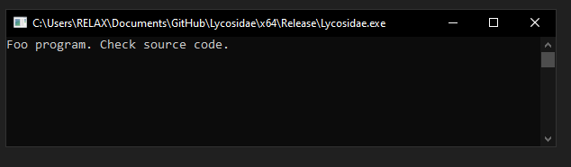
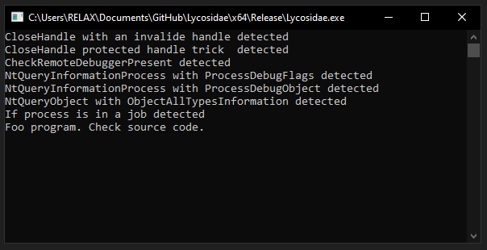

# Lycosidae

Modern anti-debug.

## Install
- Build t1ha
- Link `t1ha-static.lib` to project
- Build Lycosidae

## Features

- [x] Import no leak

- [x] Strings no leak

## TODO

- [ ] x86 support

- [ ] byte compare (https://forum.exetools.com/showpost.php?p=118480&postcount=2)

- [ ] hiding thread from debugger (argument ID thread)

### Import

- [ ] memcpy

- [ ] mbstowcs

- [ ] free

- [ ] malloc

- [ ] invalid_parameter_noinfo_noreturn

## Third Party

https://github.com/lurumdare/Win_API_Obfuscation/tree/t1ha

https://github.com/lurumdare/ScyllaHideDetector

https://github.com/XShar/Super_Hide_String

## Screenshots

Not debugged

Debugged with ScyllaHide

